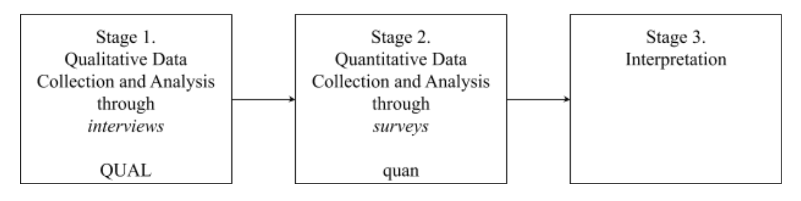

```{r setup, include=FALSE}
usethis::use_git_ignore(c("*.csv", "*.rds"))
options(htmltools.dir.version = FALSE)

#titleSlideClass: [inverse, center, middle]
#"default", "metropolis", "metropolis-fonts", 

# see options for customize slides: 
# https://slides.yihui.name/xaringan/
# https://slides.yihui.name/xaringan/incremental.html
# https://github.com/yihui/xaringan/wiki

library(knitr)
library(tidyverse)
library(xaringan)
```

class: inverse, center, middle

# Early-career Educators

---

# Induction

### Transition from preparation to practice

```{r, out.width = "720px", echo = FALSE, fig.align = "center"}
include_graphics("img/teacher.jpg")
```

---

# Induction

### Tension between two worlds about what and how to teach

```{r, out.width = "600px", echo = FALSE, fig.align = "center"}
include_graphics("img/two-worlds.jpg")
```

--

1. Educator preparation program

--

1. School of employment

---

# Induction

### Social media: From two worlds to many worlds

```{r, out.width = "720px", echo = FALSE, fig.align = "center"}
include_graphics("img/many-worlds.jpg")
```

---

# Induction

### A universe

```{r, out.width = "720px", echo = FALSE, fig.align = "center"}
include_graphics("img/universe.jpg")
```

---

# Induction

### An edu-verse: 

many voices offering ideas about what and how to teach

```{r, out.width = "700px", echo = FALSE, fig.align = "center"}
include_graphics("img/edu-verse.jpg")
```

---

class: inverse, center, middle

# Purpose

---

# Purpose

### The purpose of this study is to explore:

--

* what supports for professional learning ECEs seek during induction, if any; 

--

* from whom; and 

--

* how, if at all, they use social media with the intention of seeking supports and connections.

```{r, out.width = "420px", echo = FALSE, fig.align = "center"}
include_graphics("img/purpose.jpg")
```

---

class: inverse, center, middle

# Framework

---

# Professional Learning Networks

```{r, out.width = "600x", echo = FALSE, fig.align = "center"}
include_graphics("img/network.jpg")
```

--

* Local + global

--

* Formal + informal

---

# Professional Learning Networks

```{r, out.width = "600px", echo = FALSE, fig.align = "center"}
include_graphics("img/network.jpg")
```

--

* Interpersonal connections

--

* Supports for professional learning

--

* Underlying reasons why

---

class: inverse, center, middle

# Review of Literature

---

# Teacher Induction

```{r, out.width = "600px", echo = FALSE, fig.align = "center"}

```

--

1. Primarily formal induction programs

--

1. Induction challenges: everything new, still learning, identity development

--

1. Primarily local relationships

---

# Educators’ Use of Social Media

```{r, out.width = "600px", echo = FALSE, fig.align = "center"}

```

--

1. Primarily informal learning opportunities

--

1. General difficulty of teaching: tiring, specific ideas, professional isolation

--

1. Primarily global relationships

---

class: inverse, center, middle

# Purpose

---

# Purpose

### Again, the purpose of this study is to explore:

--

* what supports for professional learning ECEs seek during induction, if any; 

--

* from whom; and 

--

* how, if at all, they use social media with the intention of seeking supports and connections.

```{r, out.width = "420px", echo = FALSE, fig.align = "center"}
include_graphics("img/purpose.jpg")
```

---

# Research Questions

```{r, out.width = "360", echo = FALSE, fig.align = "center"}
include_graphics("img/question.jpg")
```

--

* RQ1. What **supports for professional learning**, if any, are ECEs seeking during induction?

--

* RQ2. What **reasons**, if any, do ECEs report for seeking induction supports, and what reasons do they give, if any, for not seeking induction supports?

--

* RQ3. What **interpersonal connections** do ECEs make when seeking supports for professional learning during induction?

--

* RQ4. How, if at all, do ECEs use **social media** as a modality to access supports for professional learning during induction?

---

class: inverse, center, middle

# Method

---

# Overview of Method

### Exploratory Sequential Mixed Methods

```{r, out.width = "720", echo = FALSE, fig.align = "center"}

```

--

* *Stage 1*: Qualitative interviews to explore

--

* *Stage 2*: Quantitative surveys to generalize

--

* *Stage 3*: Interpretation

---

# Overview of Method

### This presentation reports on Stage 1: Qualitative

```{r, out.width = "720", echo = FALSE, fig.align = "center"}

```

* **Stage 1: Qualitative interviews to explore**

* *Stage 2*: Quantitative surveys to generalize

* *Stage 3*: Interpretation

---

# Stage 1: Qualitative Interviews

```{r, out.width = "480", echo = FALSE, fig.align = "center"}
include_graphics("img/interview.jpg")
```

--

### Participants

--

* MSU College of Ed Master's students

--

* 0-3 years experience

--

* Teaching in U.S.

--

* *Distinct experiences*: specialists, itinerants, starting mid-year

---

# Stage 1: Qualitative Interviews

```{r, out.width = "480", echo = FALSE, fig.align = "center"}
include_graphics("img/interview.jpg")
```

--

### Data collection

* semi-structured interviews to saturation (*n* = 9)

--

### Data analysis

* transcription, thematic analysis, IRR

---

class: inverse, center, middle

# Initial Findings

---

# RQ1. Induction Supports

```{r, out.width = "420", echo = FALSE, fig.align = "center"}
include_graphics("img/help.jpg")
```

--

* Classroom management

--

* Planning and developing curriculum

--

* Dealing with parents

--

* Teaching to standards

--

* Venting, letting off steam, and looking for emotional encouragement

---

# RQ2. Reasons for Seeking

```{r, out.width = "420", echo = FALSE, fig.align = "center"}

```

--

* Different teaching philosophy from colleagues

--

* Different outlook from students

--

* Absence of curriculum / new curriculum

--

* Available training (PD/in-service days, grad school) not always helpful

--

* Available people (paraprofessionals, support staff, subs) not always helpful

--

* Professional isolation

--

* Basic needs unmet (e.g., lack of supplies, classroom disrepair, vermin)

--

* Limited budget

---

# RQ2. Reasons for NOT Seeking

```{r, out.width = "420", echo = FALSE, fig.align = "center"}

```

--

* No flexible time (teaching to standards)

--

* Don't want to lose planning period

--

* Don't want to ask for sub

--

* Maintaining boundary between personal and professional contexts

--

* Lazy

---

# RQ3. Interpersonal Connections

```{r, out.width = "420", echo = FALSE, fig.align = "center"}
include_graphics("img/community.jpg")
```

--

* Professional learning communities (PLCs)

--

* Mentor teachers

--

* Partner teachers

--

* Support staff / paraeducators

--
  
* National organizations

---

# RQ4. Social Media Platforms

```{r, out.width = "420", echo = FALSE, fig.align = "center"}
include_graphics("img/social-media-phone.jpg")
```

--

* Facebook groups

--

* TeachersPayTeachers

--

* Instagram 

--

* Twitter

--

* Pinterest

---

# RQ4. Social Media Uses

```{r, out.width = "420", echo = FALSE, fig.align = "center"}
include_graphics("img/social-media-phone.jpg")
```

--

* Seeking inspiration and ideas

--

* Finding resources

--

* Asking questions

--

* Interacting, discussing, collaborating

--

* Venting

---

class: inverse, center, middle

# Themes

---

# "I gotta get this done"

```{r, out.width = "360", echo = FALSE, fig.align = "center"}

```

--

*I was spending a lot of time staying at school, until six o'clock.* 

--

*Because I felt like, I gotta get this done, I gotta get that done.*

---

# "We need to sit down and do this"

```{r, out.width = "360", echo = FALSE, fig.align = "center"}

```

--

*I told her at the beginning, I was like, I don't want to sit and talk about things really, for the most part. I might tell you like a five minute thing, but that's about it.*

--

*Okay, you're here for 30 minutes basically. We need to like really just sit down and do this because like, I don't know what I'm doing by myself.*

---

# "I know what I'm getting into"

```{r, out.width = "360", echo = FALSE, fig.align = "center"}

```

--

*Like, I know what I'm getting myself into when I open each one of the apps, if that makes sense.*

---

# "It's an outlet"

```{r, out.width = "360", echo = FALSE, fig.align = "center"}

```

--

*A lot of times, if I go to social media, it's kind of for an outlet, for frustrations, and difficulties...*

--

*and just like the frustration of not getting the help, and having the crappy buildings...*

--

*I was recently sharing [on social media] how I have to keep my coat and bags and giant Ziploc baggies, I don't bring friends home.*

---

# "I feel like a crappy teacher"

```{r, out.width = "360", echo = FALSE, fig.align = "center"}

```

--

*And you know, back to the Instagram thing, I do follow some teacher accounts...* 

--

*I'll follow them, and sometimes I feel like, it makes me feel like a crappy teacher.*

--

*And because like I'm seeing them do all these things. And I'm like, 'I'm tired right now. If I did all those things, I would either never sleep, or I would be just doing those things. I wouldn't be able to follow through with them and actually teach with those tools that they're spending hours making on the weekend.'*

--

*And it just, it makes me feel like I should be doing more. But I already feel like I'm doing more than I can keep up with.*

---

# "I am just the viewer"

```{r, out.width = "360", echo = FALSE, fig.align = "center"}

```

--

*I, I wish, because my Instagram is very one-sided, like teachers are telling me things... I just don't add to it ever. I just am the viewer, I guess you could say.* 

--

*And so I kind of wish that I would have gotten more involved and communicated with more people to get more out of it.*

--

*I kind of felt like I was just kind of watching things go by. And if I would have maybe engaged more with it, I would have realized, kind of the resources that were out there. I don't know, that's a hard one.*

--

*But I think, just, I wish I would have started sooner and found resources that I felt like I might have needed that first at least half year.*

---

# "I'll contribute someday"

```{r, out.width = "360", echo = FALSE, fig.align = "center"}

```

--

*So yeah, guilty, guilty admission on Pinterest, I'm a taker.* 

--

*But I think in the long scheme, I'll be a contributor. I keep saying, some of the things, I create a lot for my classes, and I do want to put them on TeachersPayTeachers. Probably donation-based, but I like the idea of free, to be honest with you. I also like capitalism, don't get me wrong. I like the idea that you can get paid if you want to for your good ideas.*

--

*But, I don't know, I don't have a problem with putting some of the things up that I have for free. That's going to be a goal of mine in the next few years, though, if I think I have some quality ideas, throw them up there.*

---

class: inverse, center, middle

# Significance

---

# Implications for Practice

```{r, out.width = "420", echo = FALSE, fig.align = "center"}
include_graphics("img/learning.jpg")
```

--

* *for new teachers*: disover professional learning that has worked (and not worked) for peers

--

* *for teacher educators*: remember the tensions in the journey for new teachers

--

* *for policy*: deepen understanding of new teachers to help address teacher attrition and turnover

---

class: inverse, center, middle

# Conclusion

---

# Under Construction

```{r, out.width = "600px", echo = FALSE, fig.align = "center"}
include_graphics("img/construction.jpg")
```

**No conclusions yet... this is still a work in progress!**

---

class: inverse, center, middle

# Questions?

Email: staudtwi@msu.edu
Twitter: @bretsw
Web: bretsw.com
